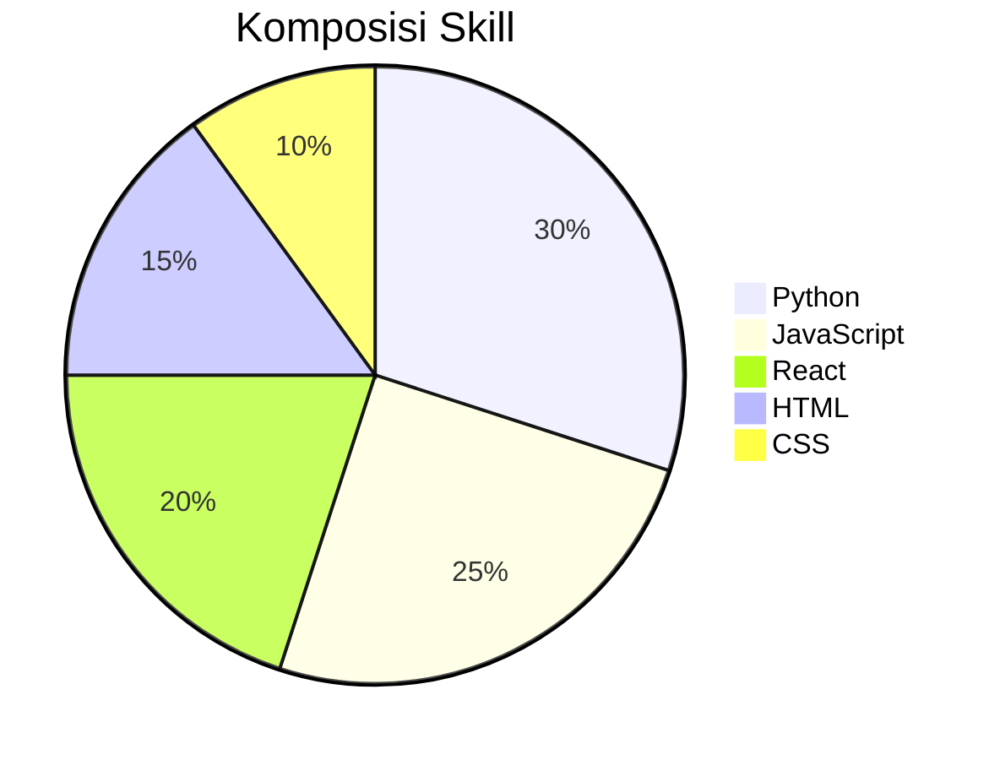
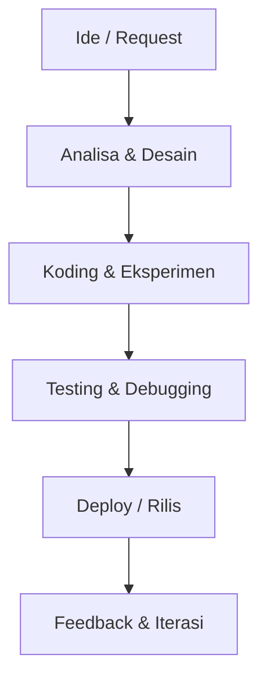
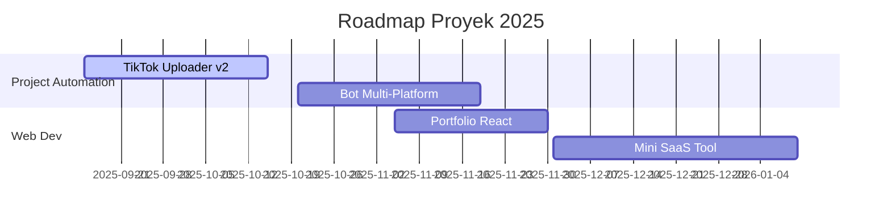

# Hi, saya Dickkyz21 👋

**Developer • Automation Enthusiast • Open-Source Learner**

Saya membangun berbagai project open-source, khususnya di bidang otomatisasi, bot, dan web development.  
Fokus saya saat ini adalah menguasai **Python, JavaScript, dan React** sambil mengembangkan tools bermanfaat untuk komunitas.

---

## 🛠️ Skill Utama

---

## 🔄 Workflow / Cara Kerja Saya

---

## 📅 Roadmap Singkat

---

## 📈 Statistik GitHub

  

---

## 📊 Kontribusi & Aktivitas

  

---

## 🎯 Goals 2025
- Membuat **TikTok Uploader v2** lebih stabil & scalable  
- Menyelesaikan **Portfolio React** sebagai showcase pribadi  
- Merilis minimal **2 project open-source** baru  
- Berkontribusi di project open-source lain  

---

## ☕ Dukungan

Jika kamu suka dengan project saya, kamu bisa bantu dengan dukungan kecil:

---

## 🎥 Video Terbaru dari YouTube

  
  

---

## 📌 Statistik Tambahan

  
  

---

✨ *“Code. Automate. Share. Repeat.”*
