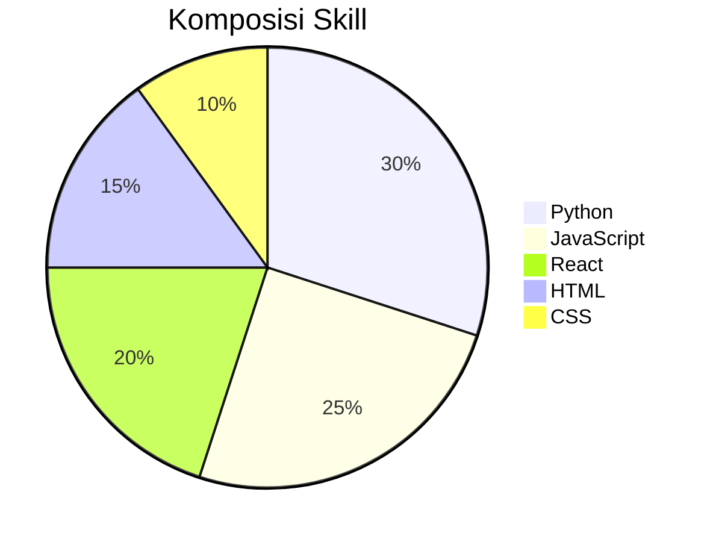
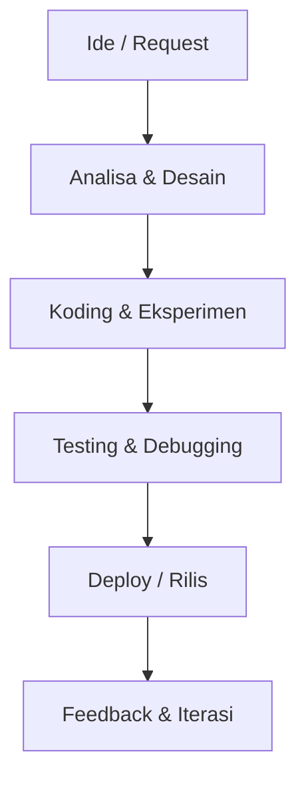
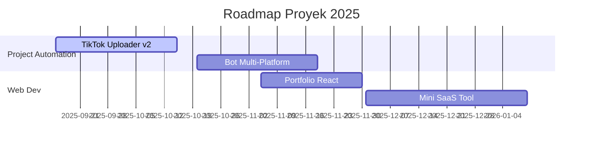

# Hi, saya Dickkyz21 👋

**Developer • Automation Enthusiast • Open-Source Learner**

Saya membangun berbagai project open-source, khususnya di bidang otomatisasi, bot, dan web development.  
Fokus saya saat ini adalah menguasai **Python, JavaScript, dan React** sambil mengembangkan tools bermanfaat untuk komunitas.

---

## 🛠️ Skill Utama

---

## 🔄 Workflow / Cara Kerja Saya

---

## 📅 Roadmap Singkat

---

## 📊 Statistik & 🏆 Kontribusi
| Statistik                                                                                                      | Kontribusi                                                                                        |
| -------------------------------------------------------------------------------------------------------------- | ------------------------------------------------------------------------------------------------- |
|  |  |

---

## ☕ Dukungan

Jika kamu suka dengan project open-source saya dan ingin mendukung pengembangannya, kamu bisa traktir kopi di sini:

---

✨ *“SUHUKU PEDIA - Posko Digital Creative Indonesia.”*
